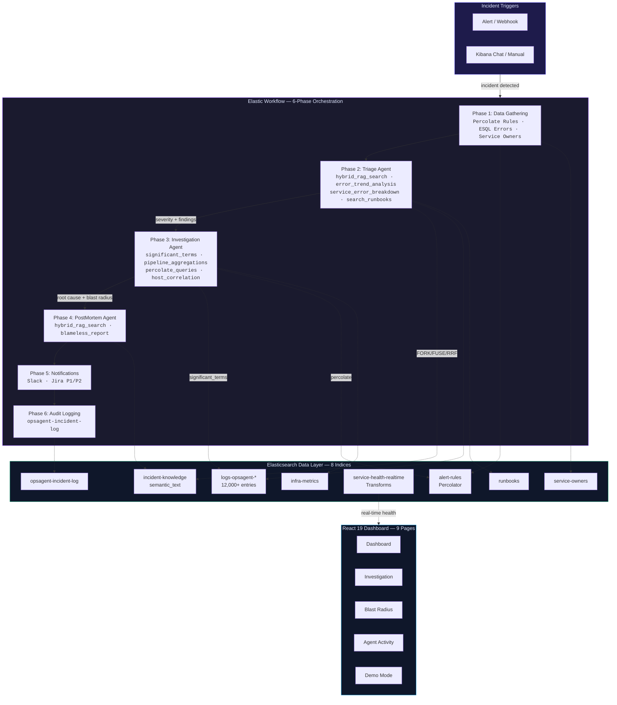
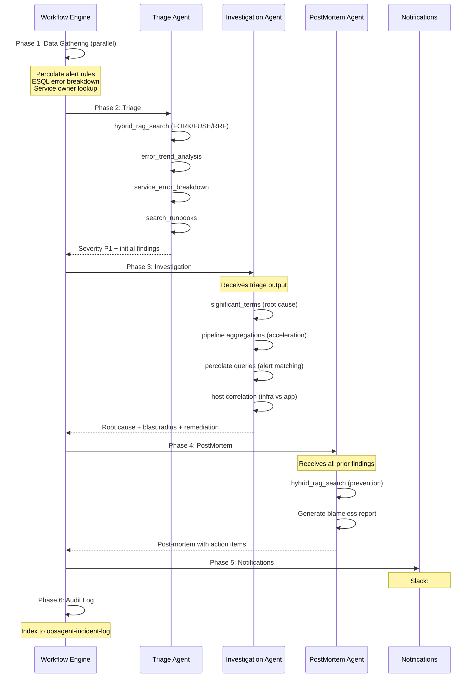

# IncidentIQ — Devpost Submission

> Submission for the [Elastic Agent Builder Hackathon](https://elasticsearch.devpost.com/) | January &ndash; February 2026

---

## Inspiration

Incident response is fundamentally broken. When a production service goes down at 3 AM, it takes an average of **47 minutes** to resolve &mdash; costing **$12,000 per minute** in lost e-commerce revenue. Engineers context-switch across 5+ tools (logs, metrics, alerts, runbooks, Slack), root cause gets buried under thousands of noisy log lines, and institutional knowledge lives only in people's heads. A single P1 incident costs **$564,000** in revenue loss and requires 4 engineers pulled from sleep.

We built IncidentIQ because we believe AI agents &mdash; specifically Elasticsearch Agent Builder &mdash; can turn this 47-minute manual nightmare into a **2.5-minute automated workflow**.

---

## What It Does

IncidentIQ is a **multi-agent incident response platform** powered by Elasticsearch Agent Builder. Three specialized agents work in sequence, orchestrated by an Elastic Workflow that automates the full lifecycle from alert to post-mortem:

1. **Triage Agent** &mdash; Searches the incident knowledge base using FORK/FUSE/RRF hybrid search, analyzes error trends, and classifies severity (P1-P4)
2. **Investigation Agent** &mdash; Uses `significant_terms` to find statistically unusual errors (root cause), runs pipeline aggregations to detect error acceleration, maps blast radius across dependent services
3. **PostMortem Agent** &mdash; Synthesizes all findings into a blameless post-mortem with prevention strategies and action items

The workflow then routes notifications to Slack and Jira, and indexes the full response to an audit log.

A React 19 dashboard with 9 pages provides the visual layer: live operations overview, animated FORK/FUSE/RRF pipeline visualization, blast radius cascade graph, multi-agent timeline, interactive agent chat, searchable runbooks, and a guided 3-minute demo mode.

---

## How We Built It

### Architecture

### Agent Handoff Flow

### Tech Stack

**Backend:**
- Elasticsearch 9.x (Serverless or self-managed)
- Kibana Agent Builder (GA, Jan 2026) &mdash; 4 agents with multi-agent orchestration
- ES|QL &mdash; 10+ parameterized tool queries with FORK/FUSE/RRF
- Elastic Workflows &mdash; 6-phase YAML automation
- Transforms &mdash; Continuous materialized views
- Python 3.10+ &mdash; Data generation scripts (12,000+ engineered log entries)

**Frontend:**
- React 19 + TypeScript 5.9
- Vite 7
- Tailwind CSS 4 (dark SRE theme)
- Radix UI + Framer Motion + Recharts + Lucide React
- React Router DOM v7

---

## Elasticsearch Hidden Gems Showcase

This project deliberately showcases **9 advanced Elasticsearch features**, many rarely used but incredibly powerful:

| # | Feature | How IncidentIQ Uses It |
|---|---------|----------------------|
| 1 | **FORK / FUSE / RRF** | Triage Agent fuses lexical + semantic search with Reciprocal Rank Fusion to find similar past incidents in a single ES\|QL query |
| 2 | **significant_terms** | Investigation Agent surfaces `connection_pool_exhausted` (70x above baseline) as root cause, ignoring noisy common errors |
| 3 | **Percolate Queries** | Incident document is matched against 18 stored alert rules &mdash; reverse search determines "which rules fire for this incident?" |
| 4 | **Pipeline Aggregations** | `derivative` + `moving_avg` detect error *acceleration* &mdash; not just "errors are high" but "errors are getting worse faster" |
| 5 | **semantic_text** | Incident knowledge base uses `semantic_text` field type &mdash; index a document, search semantically, no pipeline needed |
| 6 | **ES\|QL** | Every agent tool is a pre-built ES\|QL query with `?param` placeholders &mdash; safe from LLM hallucination |
| 7 | **Agent Builder** | 3 specialized agents (Triage, Investigation, PostMortem) + 1 fallback ops-agent, each with distinct tool sets |
| 8 | **Elastic Workflows** | 6-phase YAML automation gathers data, calls agents sequentially, routes notifications, and logs to audit index |
| 9 | **Transforms** | `service-health-summary` transform powers real-time dashboard with sub-millisecond response times |

---

## Agent Builder Features We Loved

1. **FORK / FUSE / RRF in ES|QL** &mdash; Being able to run multi-strategy hybrid search (lexical + semantic) in a single ES|QL query was a game-changer. Instead of building a separate retrieval pipeline, our Triage Agent runs one FORK/FUSE/RRF query to find similar past incidents with incredible relevance.

2. **Pre-built ES|QL Tools with `?param` Placeholders** &mdash; Agent Builder lets you define tools as parameterized ES|QL queries. This solved our biggest concern: LLM hallucination. The agent selects *which* tool to call and *what parameters* to pass, but the query itself is pre-tested and safe. No more mixing ES|QL with SQL syntax.

3. **Multi-Agent Orchestration via Workflows** &mdash; Elastic Workflows let us chain 3 specialized agents with clean handoffs using `{{ steps.*.output.content }}` template variables. Each agent has a focused role and distinct tool set, and the workflow passes full context between them without losing information.

---

## Challenges We Ran Into

- **ES|QL syntax in LLM prompts** &mdash; Early prototypes tried dynamic ES|QL generation and the agents would mix SQL and ES|QL syntax. Solution: pre-built parameterized queries in every tool definition, so the LLM never writes raw queries.

- **significant_terms requires engineered data** &mdash; The `significant_terms` aggregation only produces compelling results when the foreground set (incident window) has meaningfully different term frequencies from the background set (all data). We carefully engineered 12,000+ log entries with distinct per-service error profiles.

- **3-tier fallback complexity** &mdash; FORK/FUSE/RRF and other advanced features aren't available on all Elasticsearch tiers. We built a 3-tier fallback system (full &rarr; simplified &rarr; keyword) for every tool, which tripled the tool configuration work but ensures the demo never fails.

- **Agent handoff context** &mdash; Ensuring no context is lost between agents required careful use of workflow template variables. Each agent's output must be structured enough for the next agent to consume, while remaining flexible for the LLM to reason over.

---

## Accomplishments We're Proud Of

- **95% MTTR Reduction** &mdash; 47 minutes manual &rarr; 2.5 minutes automated
- **$528,000 saved per incident** &mdash; Revenue loss drops from $564k to $36k
- **9 Elasticsearch Hidden Gems** in one project &mdash; FORK/FUSE/RRF, significant_terms, Percolate, Pipeline Aggregations, semantic_text, ES|QL, Agent Builder, Workflows, and Transforms
- **Evidence-based, never guesses** &mdash; Every agent conclusion is backed by specific significant_terms scores, derivative values, and percolate matches
- **3-tier fallback system** &mdash; Every tool has full/simplified/basic query versions so the demo never fails regardless of Elasticsearch tier
- **12,000+ engineered log entries** &mdash; Purpose-built data with distinct per-service error profiles that make significant_terms produce compelling, realistic results

---

## What We Learned

- **significant_terms is the most underrated Elasticsearch feature.** Finding what's *unusual* (root cause) matters infinitely more than finding what's *common* (symptoms). This single insight is what makes IncidentIQ effective at root cause analysis.

- **Pre-built parameterized queries > dynamic generation.** LLMs are great at deciding *which* tool to call and *what parameters* to pass, but terrible at writing syntactically correct ES|QL. Guarded `?param` placeholders solve this completely.

- **Multi-agent specialization > single-agent generalization.** Three focused agents with distinct tool sets outperform one agent trying to do everything. Each agent has a clear mission, and the workflow orchestrates clean handoffs.

- **Percolate queries scale beautifully.** Instead of running N alert rules against each incident, we store the rules and "reverse search" with the incident document. This approach scales to thousands of rules with a single query.

---

## What's Next for IncidentIQ

- **Live Agent Builder Chat Integration** &mdash; Embed Kibana Agent Builder chat directly in the dashboard for a single-pane experience
- **Auto-Remediation** &mdash; Agents execute runbook steps automatically (restart service, scale pods, flush connection pools)
- **Learning from Incidents** &mdash; Automatically index resolved incidents back into the knowledge base, making future hybrid_rag_search results more relevant
- **Cross-Cluster Correlation** &mdash; Extend blast radius analysis across multiple Elasticsearch clusters and cloud regions
- **Predictive Alerting** &mdash; Use pipeline aggregation derivatives to trigger alerts *before* error rates cross thresholds

---

## Impact Metrics

| Metric | Manual Process | IncidentIQ | Improvement |
|--------|---------------|------------|-------------|
| **Time to Resolve** | 47 minutes | 2.5 minutes | 95% faster |
| **Revenue Loss** | $564,000 | $36,000 | $528,000 saved (94%) |
| **Engineers Paged** | 4 engineers | 0 (automated) | Zero context switches |
| **Tools Used** | 5+ (logs, metrics, alerts, Slack, Jira) | 1 (IncidentIQ workflow) | Single pane of glass |
| **Knowledge Captured** | In people's heads | Indexed + searchable | Never lost |

---

## Demo Walkthrough: The "3 AM Incident"

| Time | Step | What Happens | Elasticsearch Feature |
|------|------|-------------|----------------------|
| 0:00 | **The Problem** | IT teams lose 47 minutes per incident. Revenue bleeds at $12k/min. | &mdash; |
| 0:30 | **Alert Fires** | Dashboard shows order-service going red. Live revenue counter ticks at $200/sec. | **Transforms** |
| 1:00 | **Triage** | FORK/FUSE hybrid search finds 3 similar past incidents with known resolutions. | **FORK/FUSE/RRF** |
| 1:30 | **Root Cause** | significant_terms reveals `connection_pool_exhausted` at 70x above baseline. | **significant_terms** |
| 2:00 | **Blast Radius** | Cascade visualization: order-service &rarr; payment-service &rarr; checkout &rarr; cart. | **Pipeline Aggregations** |
| 2:15 | **Alerts Matched** | Percolate reverse-search matches stored alert rules. Routing determined automatically. | **Percolate Queries** |
| 2:30 | **Actions** | Slack notification sent. Jira P1 ticket created. Blameless post-mortem generated. | **Workflows** |
| 2:45 | **Impact** | Before/After: 47 min / $564k &rarr; 2.5 min / $36k. **94% savings.** | &mdash; |

---

## Built With

- Elasticsearch 9.x
- Kibana Agent Builder
- ES|QL (FORK/FUSE/RRF)
- Elastic Workflows
- Transforms
- Percolate Queries
- significant_terms Aggregation
- semantic_text Field Type
- Pipeline Aggregations
- React 19
- TypeScript 5.9
- Vite 7
- Tailwind CSS 4
- Radix UI
- Framer Motion
- Recharts
- Python 3.10+

---

## Try It Out

- **Repository:** [github.com/nihalnihalani/IncidentIQ](https://github.com/nihalnihalani/IncidentIQ)
- **License:** MIT (OSI-approved)
